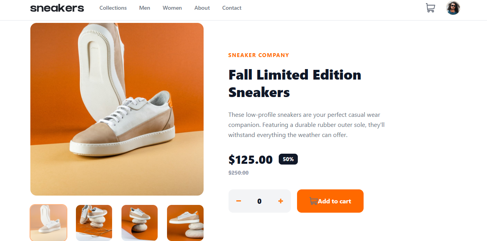

This is a solution to the E-commerce product page challenge on Frontend Mentor.

Table of contents
The challenge
Screenshot
Links
My process
Built with
What I learned
Continued development
Useful resources
AI Collaboration
Author
Acknowledgments

Live Site URL: https://ecommerce-product-page-lovat-nine.vercel.app/

My process
Built with
React 18 — component-based UI
TypeScript — type-safe props and state
Tailwind CSS — utility-first styling with responsive prefixes
Vite — fast dev server and build tool
Mobile-first responsive workflow
Semantic HTML5 markup
CSS Flexbox and Grid via Tailwind utilities

What I learned
The modulo trick for image cycling
Using % (modulo) to wrap image indices so they loop around cleanly:
// Goes to previous image, wrapping from 0 back to the last index
const goToPrev = () =>
setSelectedImage((prev) => (prev - 1 + images.length) % images.length)

Continued development
Areas I want to keep improving in future projects:

Custom hooks — extract repeated logic (like the image cycling logic) into reusable useGallery() hooks
Accessibility — add proper aria-expanded, aria-controls, and keyboard navigation (Escape to close modals, arrow keys for gallery)
Animations — add smooth transitions for the cart dropdown and mobile menu using CSS transitions or Framer Motion
Testing — write component tests with React Testing Library to verify interactions work correctly

Useful resources
Tailwind CSS Docs — The responsive prefix system (md:, lg:) was essential. The search is excellent.
React TypeScript Cheatsheet — Extremely helpful for understanding how to type props, events, and useState correctly as a beginner.
Josh W Comeau — The Interactive Guide to Flexbox — Finally made Flexbox click for me visually.
MDN — stopPropagation — Helped me understand why nested click handlers were firing unexpectedly.

AI Collaboration
I use claude. I used it to help debig Typescript errors

What worked well:
Breaking the project into small files and building one component at a time kept things manageable

Author
Frontend Mentor - https://www.frontendmentor.io/profile/Barnabas001
GitHub - https://github.com/Barnabas001

Acknowledgments
Big thanks to the Frontend Mentor community for feedback on solution approaches. This challenge was a great way to practice component architecture in React — breaking one big UI into small, focused pieces that each do one job well.
